# 🛒 AMRY LUXE - Tienda Virtual E-Commerce

¡Bienvenido al repositorio oficial de **AMRY LUXE**! Una plataforma de comercio electrónico moderna, robusta y auto-gestionable diseñada a medida para optimizar los procesos comerciales y la venta de carteras y accesorios exclusivos.

---

## 🚀 Tecnologías Utilizadas

Este proyecto fue desarrollado bajo una arquitectura full-stack moderna y eficiente:

*   **Backend:** PHP 8.2+ con el Framework **Laravel 12**
*   **Base de Datos:** MySQL / MariaDB (Estructura relacional optimizada)
*   **Frontend:** Vistas dinámicas e interactivas integradas (HTML5, Bootstrap 5, JavaScript / Vue 3)

---

## 🛠️ Características Principales

*   **Catálogo Dinámico:** Gestión completa de colecciones exclusivas, categorías y stock de productos en tiempo real.
*   **Panel de Administración (Admin Dashboard):** Panel intuitivo para el control y actualización de productos, banners publicitarios y ofertas especiales.
*   **Carrito de Compras:** Experiencia de usuario fluida para la selección, acumulación y cálculo de productos.
*   **E-Commerce Adaptable (Responsive Design):** Interfaz totalmente optimizada para una navegación perfecta en dispositivos móviles, tablets y computadoras.
*   **Cumplimiento Normativo:** Integración directa con enlaces locales indispensables como el **Libro de Reclamaciones**.

---

## 📸 Vista Previa de la Plataforma

### 🌐 Interfaz Pública de la Tienda
| Home Principal | Menú de Categorías |
| :---: | :---: |
| 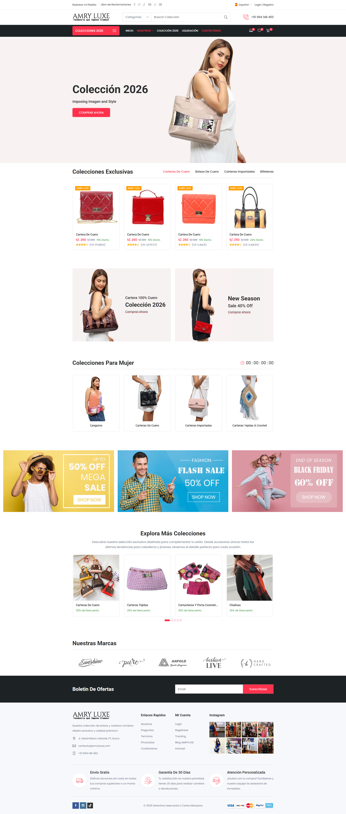 | 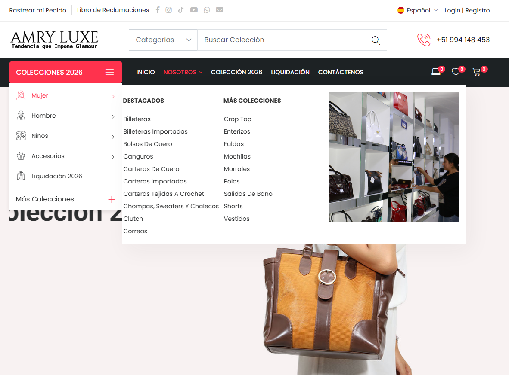 |

| Catálogo de Productos | Sección Liquidación |
| :---: | :---: |
| 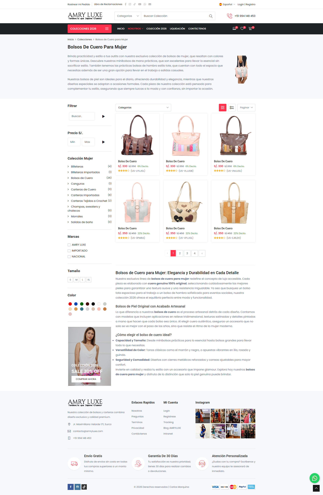 | 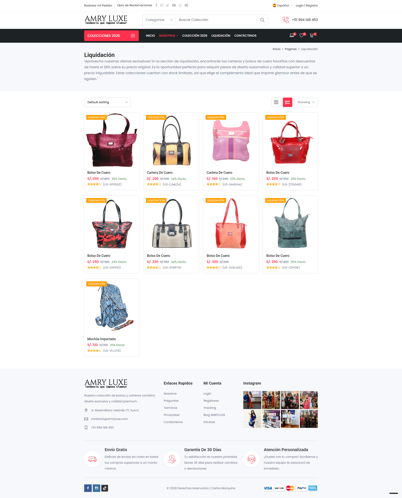 |

### 🛍️ Proceso de Compra y Detalle
| Vista de Detalle | Carrito de Compras |
| :---: | :---: |
| 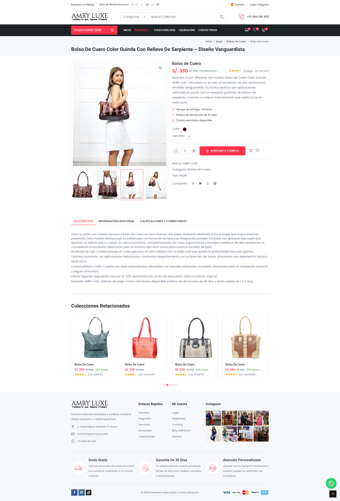 | 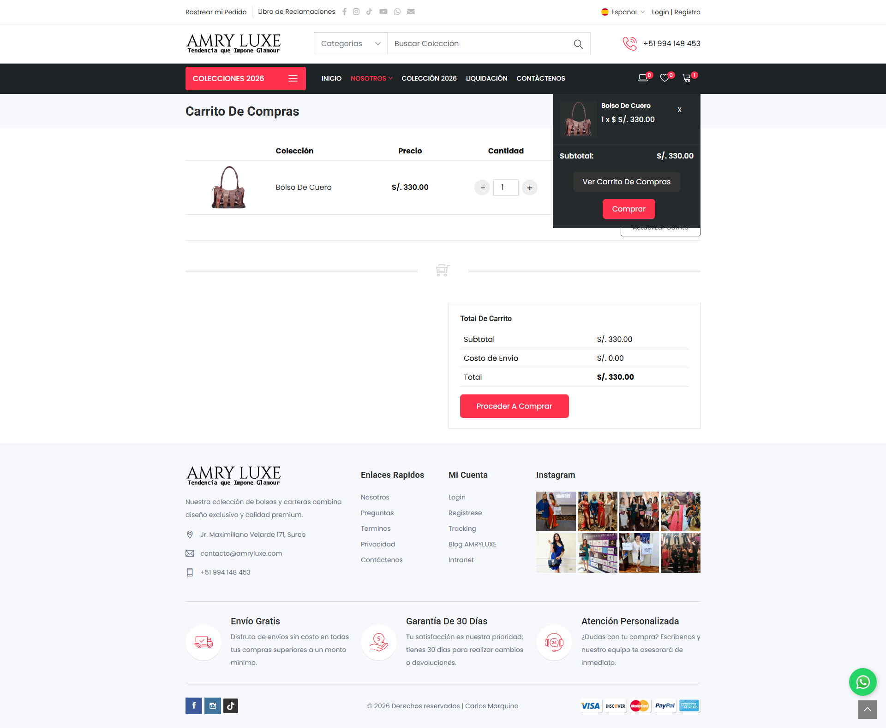 |

<details>
<summary>🔑 Ver Capturas de Autenticación, Historia y Gestión (Clic para desplegar)</summary>

### 🔐 Registro e Inicio de Sesión
| Login de Usuario | Formulario de Registro |
| :---: | :---: |
| 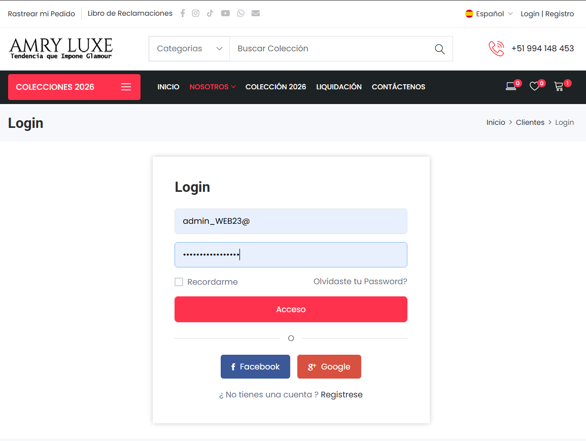 | 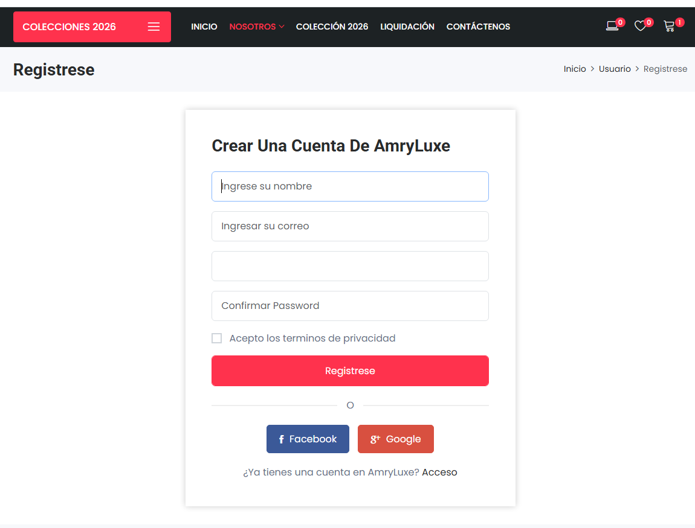 |

### 📖 Secciones Adicionales y Soporte
| Página de Historia | Libro de Reclamaciones |
| :---: | :---: |
| 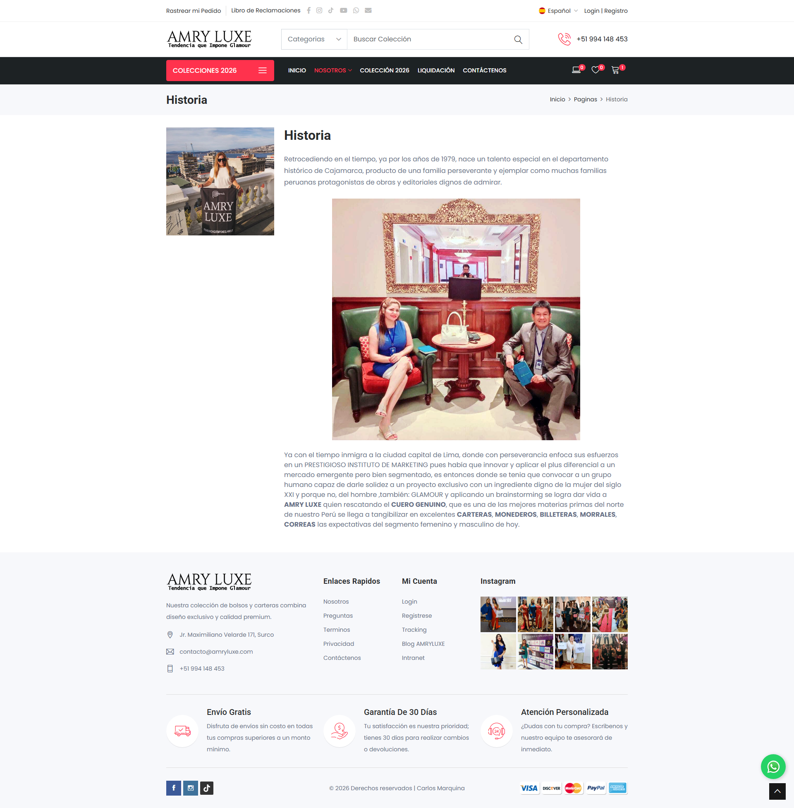 | 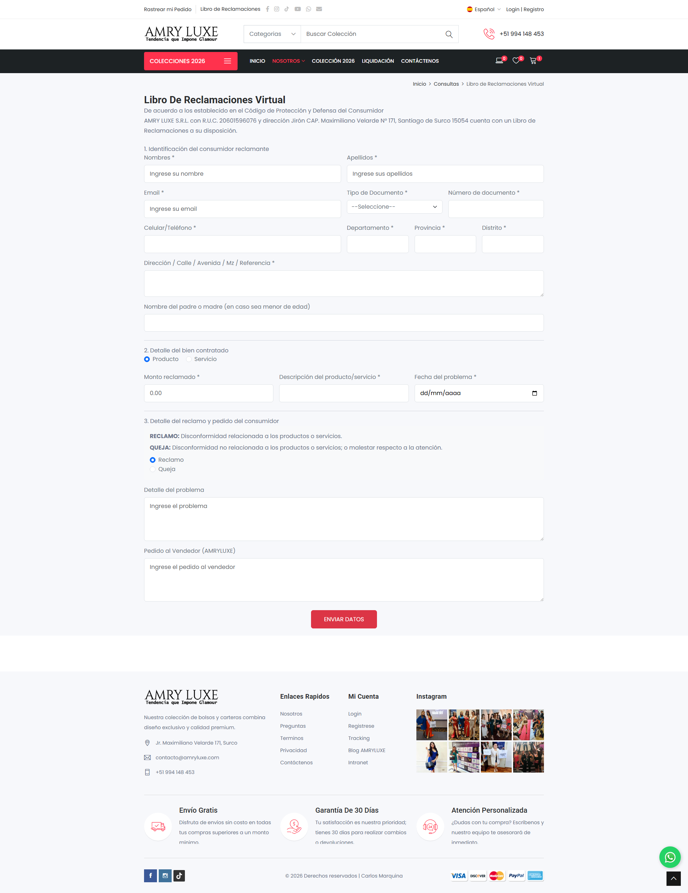 |

### ⚡ Gestión Interna
| Acción: Agregar Producto al Sistema |
| :---: |
| 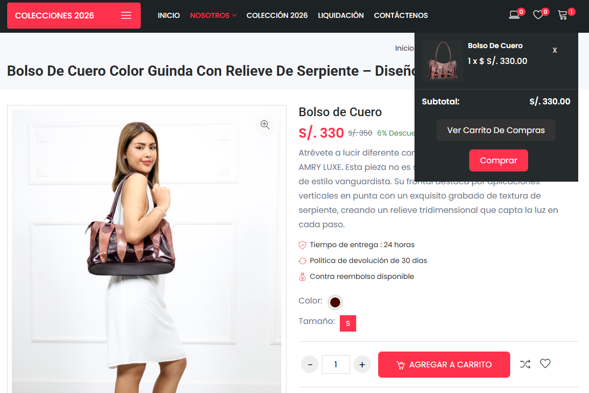 |

</details>

## 📦 Instrucciones de Instalación

Si deseas clonar este proyecto y ejecutarlo en tu entorno local, sigue estos pasos:

### 1. Clonar el repositorio
```bash
git clone [https://github.com/karlosystem/AMRYLUXE-PHP-LARAVEL.git](https://github.com/karlosystem/AMRYLUXE-PHP-LARAVEL.git)
cd AMRYLUXE-PHP-LARAVEL
